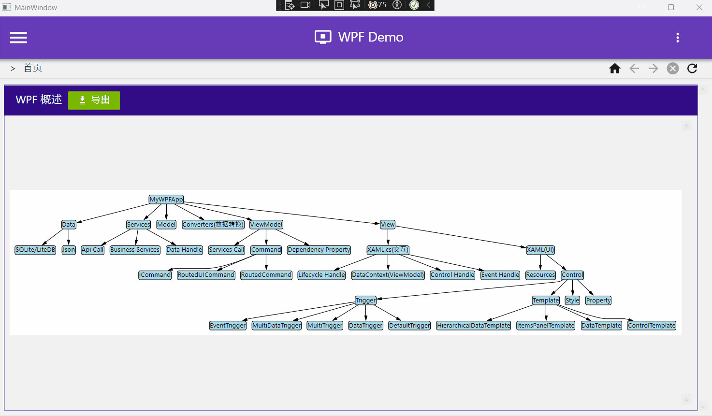
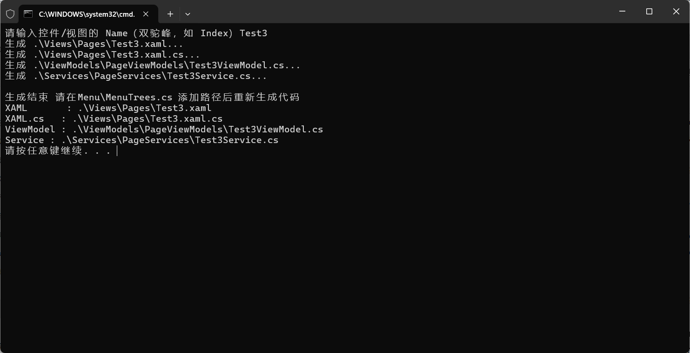
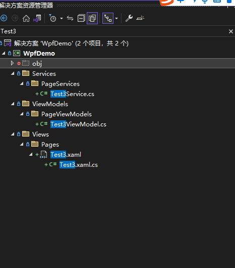
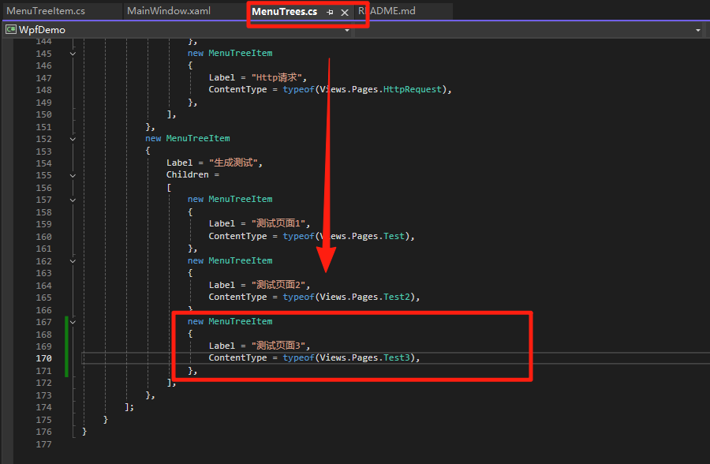
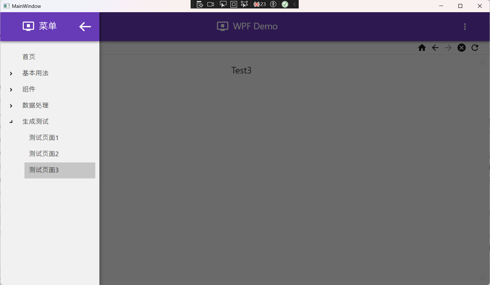

# WpfDemo

本项目为 [WPF 教程](https://chenrui1996.github.io/CSharpGuide/c-sharp/WPF.html) 示例。

目录参照 [WPF 教程](https://chenrui1996.github.io/CSharpGuide/c-sharp/WPF.html) 。

::: tip 

本项目采用 [MaterialDesignThemes](https://github.com/MaterialDesignInXAML/MaterialDesignInXamlToolkit) 作为前端组件库。

但，MaterialDesignThemes 不包括：

1. 分页控件
2. 面包屑控件
3. Growl 信息通知
……

等关键控件。

如需要丰富控件，推荐使用：[handyorg](https://handyorg.github.io/)

:::

项目展示：



## 菜单树

项目菜单从 `/Menu/MenuTrees.cs` 中加载 [如有需要可从后台获取] 到菜单树。

示例:

``` csharp
new MenuTreeItem { Label = "首页", ContentType = typeof(Views.Pages.Index) },
```

在菜单树项 终端节点（Terminal Node）[没有子节点的叶子节点] 中保存了对应菜单的页面内容。

当菜单树已选择菜单变化时，由 `ContentControl` 动态加载。

除此之外，

每个页面内容被依赖注入了其对应的 ViewModel。ViewModel 中又依赖注入了对应的 Service。

以上均不需要手动编写对应代码。


## 代码生成

1. 点击项目根目录中的 `GeneratePage.bat` 输入想要的页面名称。





2. 生成结束后，在`/Menu/MenuTrees.cs`添加目录。





3. 在对应页面、ViewModel、Services中编写业务代码。